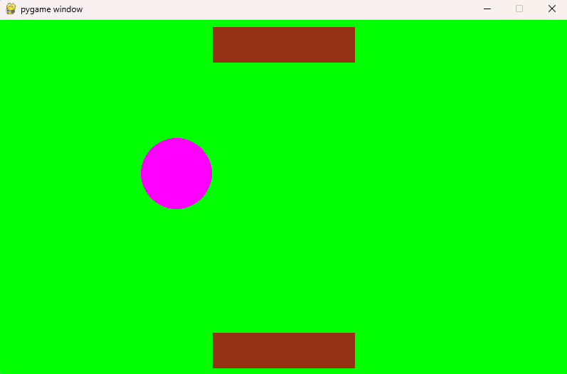

# Игра "пинг-понг"
## Описание
Пинг-понг- интересная игра,в которой два игрока отбивают мяч ракетками,страраясь не допусть, чтобы он упал на их сторону.
## Возможности игры
- Каждый игрок по очереди отбивает мяч ракеткой.
- Очки начисляются за промах противника.
- Игра продолжается до определенного количества очков.
- В конце игры в терминале показывается чья ракетка выиграла.
## Чему научилась
- Работа со сторонними библиотеками и установка библиотеки pygame.
- Создание окна и бесконечный игровой цикл.
- Работа с цветом в формате rgb.
- Обновление экрана после отрисовки.
- Отрисовка примитивных фигур с помощью встроенных функций.
- Анимация движения.
- Ограничение FPS.
- Координатная система в pygame, изменение координат объекта
прямоугольника.
## Работа игры
### Игра
